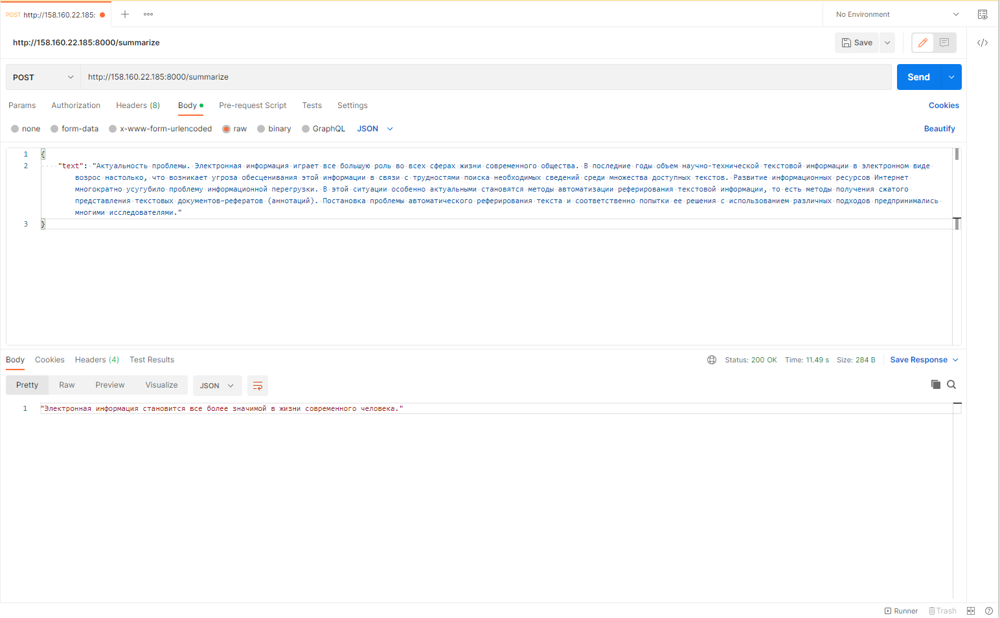

### Приложение для аннотирования текстов на русском языке на основе [модели](https://huggingface.co/IlyaGusev/rugpt3medium_sum_gazeta) Ильи Гусева.

#### 1. Основные используемые библиотеки
- [FastAPI](https://www.google.com)
- [Huggingface](https://huggingface.co/)
- [Pytorch](https://pytorch.org/)

#### 5. Развернутое приложение в Яндекс.Облако
Ссылка на развернутое [приложение](http://158.160.22.185:8000/summarize).

#### 6. Пример запроса к серверу в Яндекс.Облако при помощи postman


#### 7. Пример запроса к серверу в Яндекс.Облако при помощи curl
```
curl -X 'POST' \
  'http://158.160.22.185:8000/summarize/' \
  -H 'Content-Type: application/json' \
  -d '{ "Актуальность проблемы. Электронная информация играет все большую роль во всех сферах жизни современного общества. В последние годы объем научно-технической текстовой информации в электронном виде возрос настолько, что возникает угроза обесценивания этой информации в связи с трудностями поиска необходимых сведений среди множества доступных текстов. Развитие информационных ресурсов Интернет многократно усугубило проблему информационной перегрузки. В этой ситуации особенно актуальными становятся методы автоматизации реферирования текстовой информации, то есть методы получения сжатого представления текстовых документов–рефератов (аннотаций). Постановка проблемы автоматического реферирования текста и соответственно попытки ее решения с использованием различных подходов предпринимались многими исследователями." }'
```